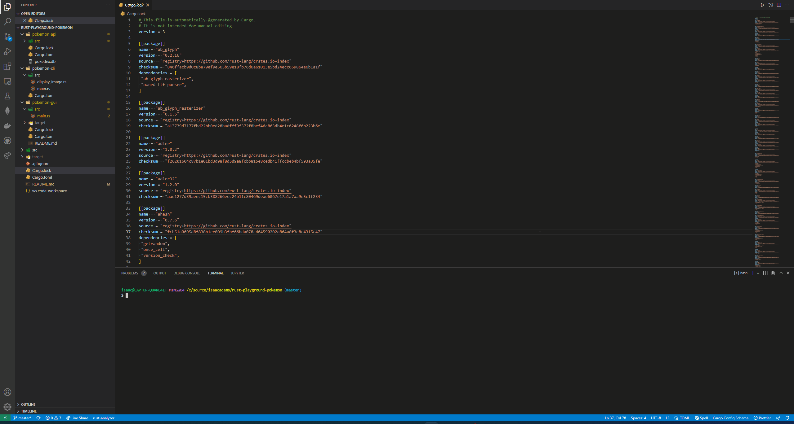

# Getting Started

The following commands will open a GUI. You can click "search" and a random pokemon will appear.

```bash
cd pokemon-gui
cargo run
```

pokemon API: https://pokeapi.co/

# Demo


